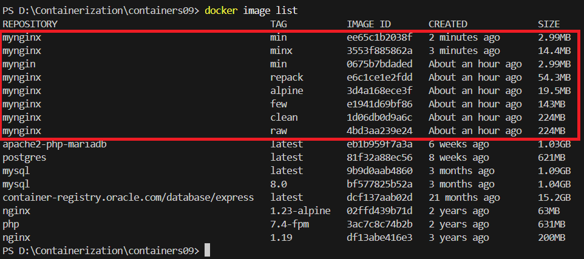

# IWNO09: Optimizarea imaginilor

* **Autor:** Straton Alexandru  
* **Grupa:** IA-2302  
* **Data:** 26.04.2025  

## Scop
Scopul acestei lucrări este familiarizarea cu `metodele de optimizare` a imaginilor `Docker`, dezvoltarea competențelor în reducerea dimensiunii imaginilor prin eliminarea dependențelor neutilizate, minimizarea numărului de straturi, utilizarea unei imagini de bază minime și reambalarea imaginilor, precum și compararea eficienței acestor metode prin construirea și testarea imaginilor într-un mediu `Docker`.

## Sarcina

Compararea diferitelor `metode de optimizare` a imaginilor `Docker` prin construirea unei aplicații web bazate pe `NGINX`, utilizând un Dockerfile pentru a configura mediul și a integra fișierele site-ului (`HTML`, `CSS`, `JS`). 
Se vor aplica și testa metode precum eliminarea dependențelor neutilizate și a fișierelor temporare, reducerea numărului de straturi, utilizarea unei imagini de bază minime (`Alpine`), reambalarea imaginilor, și combinarea tuturor acestor metode, cu verificarea dimensiunilor imaginilor rezultate.

--- 

### 1. Crearea unui proiect
 - Crearea unui *repository* pe GitHub
    - Tastăm butonul `New`  
        

    - Introducem datele repository-ului  
        

--- 

### 2. Clonarea repository-ului pe calculatorul local

 1. În repository-ul creat tastăm Code -> Local -> Clone -> HTTPS, copiem link-ul.  
        

 2. Deschidem Visual Studio sau alt IDE dorit.  
        

 3. Introducem comanda pentru clonare în consolă

    ```bash
    git clone https://github.com/straton-alex/containers09.git
    cd containers09
    ```

--- 

### 3. Crearea structurii proiectului
- În directorul `containers09` creați directorul `site` și plasați în el fișierele site-ului (`html`, `css`, `js`).

    ```bash
    mkdir ./site
    cd site
    ```
    

- Creați în directorul `./site` aplicația Web pe baza `HTML`, `CSS`, `JS` cu următoarea structură:
    ```
    containers09/
    ├── site/
    │   ├── index.html
    │   ├── styles.css
    │   └── script.js
    ```
- Fișierul `sites/index.html` 
    > Exemplu

    ```html
    <!DOCTYPE html>
    <html lang="ro">

    <head>
        <meta charset="UTF-8">
        <title>Formular de feedback</title>
        <link rel="stylesheet" href="style.css">
    </head>

    <body>
        <div class="form-container">
            <h3>Lăsați părerea dumneavoastră despre noi</h3>
            <form id="feedbackForm">
                <label for="nume">Numele:</label>
                <input type="text" id="nume" name="nume" placeholder="Enter Text" required>

                <label for="email">Emailul:</label>
                <input type="email" id="email" name="email" placeholder="Enter Text" required>

                <label for="mesaj">Textul mesajului:</label>
                <textarea id="mesaj" name="mesaj" placeholder="Enter Text" required></textarea>

                <button type="submit">Trimite</button>
            </form>
        </div>

        <h3>Părerile clienților noștri</h3>
        <div class="feedback-container" id="feedbackContainer">
            <!-- Feedback-->
        </div>

        <script src="script.js"></script>
    </body>

    </html>
    ```
    
- Fișierul `sites/style.css` 
    > Exemplu

    ```css
    body {
        font-family: Arial, sans-serif;
        background-color: #f4f4f9;
        margin: 0;
        padding: 20px;
    }

    .form-container {
        border: 2px solid #333;
        border-radius: 10px;
        padding: 20px;
        width: 350px;
        margin: 20px auto;
        background-color: #fff;
        box-shadow: 0 4px 8px rgba(0, 0, 0, 0.1);
    }

    .form-container h3 {
        text-align: center;
        color: #333;
        margin-bottom: 20px;
        font-size: 1.5em;
    }

    .form-container label {
        display: block;
        margin-bottom: 5px;
        font-weight: bold;
        color: #555;
    }

    .form-container input,
    .form-container textarea {
        width: 100%;
        padding: 10px;
        margin-bottom: 15px;
        border: 1px solid #ccc;
        border-radius: 5px;
        box-sizing: border-box;
        font-size: 1em;
        transition: border-color 0.3s ease;
    }

    .form-container input:focus,
    .form-container textarea:focus {
        border-color: #007bff;
        outline: none;
        box-shadow: 0 0 5px rgba(0, 123, 255, 0.3);
    }

    .form-container textarea {
        height: 100px;
        resize: vertical;
    }

    .form-container button {
        display: block;
        margin: 0 auto;
        padding: 10px 20px;
        background-color: #007bff;
        color: white;
        border: none;
        border-radius: 5px;
        cursor: pointer;
        font-size: 1em;
        transition: background-color 0.3s ease;
    }

    .form-container button:hover {
        background-color: #0056b3;
    }

    h3 {
        text-align: center;
        color: #333;
        font-size: 1.5em;
        margin: 30px 0 20px;
    }

    .feedback-container {
        width: 350px;
        margin: 0 auto;
    }

    .feedback-entry:nth-child(odd) {
        background-color: #ffd700;
    }

    .feedback-entry:nth-child(even) {
        background-color: #ffe4e1;
    }

    .feedback-entry {
        padding: 15px;
        margin: 10px 0;
        border: 1px solid #ccc;
        border-radius: 5px;
        font-size: 1.1em;
        color: #333;
        transition: transform 0.2s ease, box-shadow 0.2s ease;
    }

    .feedback-entry:hover {
        transform: translateY(-2px);
        box-shadow: 0 4px 8px rgba(0, 0, 0, 0.1);
    }
    ```
- Fișierul `sites/script.js` 
    > Exemplu

    ```js
    document.addEventListener('DOMContentLoaded', function () {
        const feedbackForm = document.getElementById('feedbackForm');
        const feedbackContainer = document.getElementById('feedbackContainer');

        displayFeedback();

        feedbackForm.addEventListener('submit', function (e) {
            e.preventDefault();

            const nume = document.getElementById('nume').value.trim();
            const email = document.getElementById('email').value.trim();
            const mesaj = document.getElementById('mesaj').value.trim();

            if (nume && email && mesaj && validateEmail(email)) {
                const feedback = {
                    nume: nume,
                    mesaj: mesaj
                };

                saveFeedback(feedback);
                feedbackForm.reset();
                displayFeedback();
            } else {
                alert('Vă rugăm să completați toate câmpurile corect!');
            }
        });

        function validateEmail(email) {
            const re = /^[^\s@]+@[^\s@]+\.[^\s@]+$/;
            return re.test(email);
        }

        function saveFeedback(feedback) {
            let feedbackList = JSON.parse(localStorage.getItem('feedbackList')) || [];
            feedbackList.push(feedback);
            localStorage.setItem('feedbackList', JSON.stringify(feedbackList));
        }

        function displayFeedback() {
            feedbackContainer.innerHTML = '';
            const feedbackList = JSON.parse(localStorage.getItem('feedbackList')) || [];

            if (feedbackList.length === 0) {
                feedbackContainer.innerHTML = '<div style="text-align: center; color: #555;">Nu există păreri momentan.</div>';
                return;
            }

            feedbackList.forEach(entry => {
                const div = document.createElement('div');
                div.className = 'feedback-entry';
                div.textContent = `${entry.nume}, ${entry.mesaj}`;
                feedbackContainer.appendChild(div);
            });
        }
    });
    ```
---
### 4. Teste de optimizare

- Pentru teste de optimizare a imaginilor va fi utilizată imaginea creată în bază `Dockerfile.raw`:


    ```bash
    New-Item -ItemType File -Name "Dockerfile.raw"
    ```
    

    cu următorul conținut:

    ```dockerfile
    # create from ubuntu image
    FROM ubuntu:latest

    # update system
    RUN apt-get update && apt-get upgrade -y

    # install nginx
    RUN apt-get install -y nginx

    # copy site
    COPY site /var/www/html

    # expose port 80
    EXPOSE 80

    # run nginx
    CMD ["nginx", "-g", "daemon off;"]
    ```
- Creați-l în folderul `containers09` și construiți imaginea cu numele `mynginx:raw`:

    ```bash
    docker image build -t mynginx:raw -f Dockerfile.raw .
    ```
    


### 5. Eliminarea dependențelor neutilizate și a fișierelor temporare


- Eliminați fișierele temporare și dependențele neutilizate în `Dockerfile.clean`:

    ```bash
    New-Item -ItemType File -Name "Dockerfile.clean"
    ```
    

    cu următorul conținut:

    ```dockerfile
    # create from ubuntu image
    FROM ubuntu:latest

    # update system
    RUN apt-get update && apt-get upgrade -y

    # install nginx
    RUN apt-get install -y nginx

    # remove apt cache
    RUN apt-get clean && rm -rf /var/lib/apt/lists/* /tmp/* /var/tmp/*

    # copy site
    COPY site /var/www/html

    # expose port 80
    EXPOSE 80

    # run nginx
    CMD ["nginx", "-g", "daemon off;"]
    ```
- Asamblati imaginea cu numele `mynginx:clean` 

    ```bash
    docker image build -t mynginx:clean -f Dockerfile.clean .
    ```
    
    și verificați dimensiunea:

    ```bash
    docker image list
    ```
    

### 6. Minimizarea numărului de straturi

- Minimizați numărul de straturi în `Dockerfile.few`:

    ```bash
    New-Item -ItemType File -Name "Dockerfile.few"
    ```
    

    cu următorul conținut:
    ```dockerfile
    # create from ubuntu image
    FROM ubuntu:latest

    # update system
    RUN apt-get update && apt-get upgrade -y && \
        apt-get install -y nginx && \
        apt-get clean && rm -rf /var/lib/apt/lists/* /tmp/* /var/tmp/*

    # copy site
    COPY site /var/www/html

    # expose port 80
    EXPOSE 80

    # run nginx
    CMD ["nginx", "-g", "daemon off;"]
    ```
- Construiți imaginea cu numele `mynginx:few`

    ```bash
    docker image build -t mynginx:few -f Dockerfile.few .
    ```
    
    și verificați dimensiunea:

    ```bash
    docker image list
    ```
    
---

### 7. Utilizarea unei imagini de bază minime

- Înlocuiți imaginea de bază cu `alpine` în `Dockerfile.alpine`:

    ```bash
    New-Item -ItemType File -Name "Dockerfile.alpine"
    ```
    

    cu următorul conținut:
    ```dockerfile
    # create from alpine image
    FROM alpine:latest

    # update system
    RUN apk update && apk upgrade

    # install nginx
    RUN apk add nginx

    # copy site
    COPY site /var/www/html

    # expose port 80
    EXPOSE 80

    # run nginx
    CMD ["nginx", "-g", "daemon off;"]
    ```
- Construiți imaginea cu numele `mynginx:alpine`

    ```bash
    docker image build -t mynginx:alpine -f Dockerfile.alpine .
    ```
    
    și verificați dimensiunea:

    ```bash
    docker image list
    ```
    
---
    
### 8. Repachetarea imaginii

- Repachetați imaginea `mynginx:raw` în `mynginx:repack:`

    ```bash
    docker container create --name mynginx mynginx:raw
    docker container export mynginx | docker image import - mynginx:repack
    docker container rm mynginx
    docker image list
    ```
    

---

### 9. Utilizarea tuturor metodelor

- Creați imaginea `mynginx:minx` utilizând toate metodele de optimizare. Pentru aceasta definiți următorul `Dockerfile.min`:

    ```bash
    New-Item -ItemType File -Name "Dockerfile.min"
    ```
    

    cu următorul conținut:
    ```dockerfile
    # create from alpine image
    FROM alpine:latest

    # update system, install nginx and clean
    RUN apk update && apk upgrade && \
        apk add nginx && \
        rm -rf /var/cache/apk/*

    # copy site
    COPY site /var/www/html

    # expose port 80
    EXPOSE 80

    # run nginx
    CMD ["nginx", "-g", "daemon off;"]
    ```
    

- Construiți imaginea cu numele `mynginx:minx` și verificați dimensiunea. Repachetați imaginea `mynginx:minx` în `mynginx:min`:

    ```bash
    docker image build -t mynginx:minx -f Dockerfile.min .
    docker container create --name mynginx mynginx:minx
    docker container export mynginx | docker image import - mynginx:min
    docker container rm mynginx
    docker image list
    ```
    
    
---
### 10. Pornire și testare
- Verificați dimensiunea imaginilor:

    ```bash
    docker image list
    ```
    
- Prezentați tabela cu dimensiunile imaginilor.

    | REPOSITORY | TAG    | SIZE  |
    |------------|--------|-------|
    | mynginx    | min    | 2.99 MB|
    | mynginx    | minx   | 14.4 MB|
    | mynginx    | repack | 54.3 MB|
    | mynginx    | alpine | 19.5 MB|
    | mynginx    | few    | 143 MB |
    | mynginx    | clean  | 224 MB |
    | mynginx    | raw    | 224 MB |
---


### 11. Publicarea codului pe GitHub

> Publicăm codul pe GitHub

```bash
# adăugăm toate fișierele pentru tracking
git add .
# creăm un commit
git commit -m "lab09"
# împingem în branch-ul principal
git push origin main
```

--- 

### 12. Răspunsuri la întrebări

1. **Care metoda de optimizare a imaginilor vi se pare cea mai eficientă?**

    - Cea mai eficientă metodă este **combinarea tuturor metodelor cu reambalare** (`min`), care a dus la o imagine de doar `2.99M MB`. Aceasta metodă folosește o imagine de bază minimă (`alpine`), reduce straturile, curăță fișierele temporare și aplică reambalarea pentru a elimina orice overhead rămas.
  
2. **De ce curățirea cache-ului pachetelor într-un strat separat nu reduce dimensiunea imaginii?**

   - Curățirea **cache-ului** pachetelor într-un strat separat nu reduce dimensiunea imaginii deoarece straturile anterioare, care conțin fișierele temporare, rămân neschimbate. 
   Pentru a obține o reducere efectivă a dimensiunii, trebuie de combinat comenzile de actualizare, instalare și curățire într-un singur `RUN`, astfel încât fișierele temporare să nu fie salvate în niciun strat al imaginii.

3. **Ce este repachetarea imaginii?**

   - Repachetarea imaginii `Docker` este procesul de export al sistemului de fișiere al unui container și importul acestuia ca o nouă imagine, eliminând straturile intermediare și metadatele. 
--- 
### 13. Concluzie

- Această lucrare a oferit o experiență practică în **optimizarea** imaginilor `Docker`, consolidând competențele în reducerea dimensiunii imaginilor și înțelegerea impactului diferitelor metode de optimizare. Am învățat să:

    - Creez o aplicație web bazată pe `NGINX` utilizând un `Dockerfile` pentru a configura mediul și a integra fișierele site-ului (`HTML`, `CSS`, `JS`).

    - Aplic metode de optimizare precum eliminarea dependențelor neutilizate și a fișierelor temporare, reducerea numărului de straturi, utilizarea unei imagini de bază minime (Alpine) și reambalarea imaginii.

    - Compar dimensiunile imaginilor rezultate (`mynginx:raw`, `clean`, `few`, `alpine`, `repack`, `minx`, `min`) pentru a evalua eficiența fiecărei metode.

- Rezultatul final a fost o imagine Docker optimizată (mynginx:min) care:

    - Are o dimensiune de doar `2.99 MB`, o reducere de `99%` față de imaginea inițială.

    - Demonstrează eficiența combinării tuturor metodelor de optimizare (bază minimă, straturi reduse, curățare cache, reambalare).

    - Poate fi utilizată în medii cu resurse limitate datorită dimensiunii reduse.

    Această abordare evidențiază avantajele optimizării imaginilor `Docker` pentru **eficiența stocării**, **performanța în producție** și **utilizarea optimă a resurselor** în dezvoltarea **aplicațiilor web**.

--- 

### 14. Bibliografie

*1. Curs Moodle USM, Containerizarea și Virtualizarea*

*2. Documentația oficială Docker – https://docs.docker.com/*

*3. Markdown Guide – https://www.markdownguide.org/*
